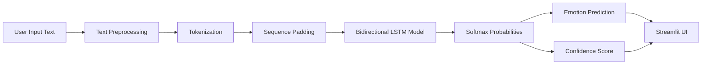
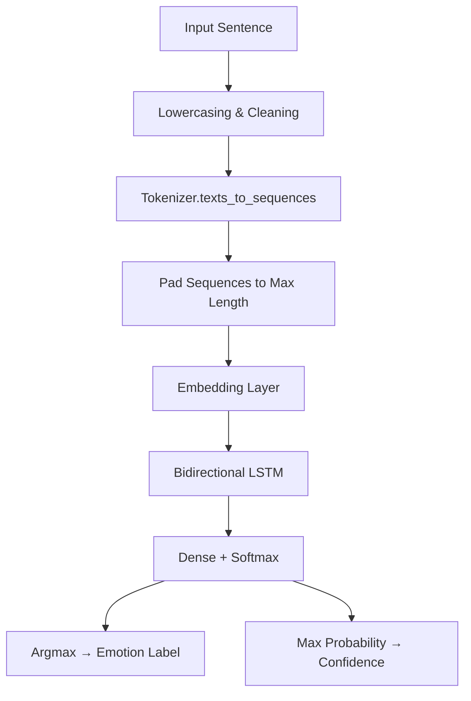

# 🧠 Contextual Emotion Detection

A deep learning–based NLP application that detects human emotions from text using a **Bidirectional LSTM** model.  
The system captures contextual meaning, provides confidence-aware predictions, and exposes results through an interactive **Streamlit** web interface.

---

## 🚀 Key Features

- 🔍 Classifies text into **6 emotion categories**
- 🧠 Uses **sequence-based deep learning (BiLSTM)** for contextual understanding
- 📊 Displays **confidence scores** and probability distribution
- ⚠️ Flags **ambiguous or mixed-emotion inputs**
- 🌐 Deployed as an **interactive Streamlit application**
- ❌ No LLMs, no APIs — **pure deep learning**

---

## 🎭 Supported Emotion Classes

- 😠 Anger  
- 😨 Fear  
- 😊 Joy  
- ❤️ Love  
- 😢 Sadness  
- 😲 Surprise  

---

## 🏗️ System Architecture



---

## 🔄 Prediction Flow 


---

## 🧠 Model Details
- Architecture: Bidirectional LSTM

- Input Length: 100 tokens

- Embedding: Trainable embeddings

- Output: Softmax over 6 emotion classes

- Loss Function: Sparse Categorical Crossentropy

- Metric: Accuracy

- Performance: ~85% validation accuracy on unseen text

---

## 🛠️ Tech Stack
| Category            | Tools / Technologies                                   |
|---------------------|--------------------------------------------------------|
| Language            | Python                                                 |
| Deep Learning       | TensorFlow, Keras                                      |
| NLP                 | Tokenization, Sequence Padding, LSTM-based Modeling    |
| Web Framework       | Streamlit                                              |
| Data Handling       | NumPy, Pandas                                          |
| Model Storage       | `.keras`, Pickle                                       |
| Version Control     | Git, GitHub                                            |

---

## 📁 Project Structure
```
Contextual-Emotion-Detection/
│
├── app.py                     # Streamlit application
├── emotion_lstm_model.keras   # Trained BiLSTM model
├── tokenizer.pkl              # Fitted tokenizer
├── label_encoder.pkl          # Emotion label encoder
├── requirements.txt           # Dependencies
├── README.md                  # Project documentation
```

---

## ▶️ How to Run Locally
### 1️⃣ Clone the repository
```
git clone https://github.com/pranayk15/Contextual-Emotion-Detection.git
cd Contextual-Emotion-Detection
```

### 2️⃣ Install dependencies
```
pip install -r requirements.txt
```

### 3️⃣ Run the application
```
streamlit run app.py
```

---

## 📊 Output Example

- Predicted Emotion: JOY 😊

- Confidence: 0.82

- Probability Distribution: Visualized across all emotions

- Ambiguity Warning: Triggered when confidence < 0.5

---

## ⚠️ Limitations

- Emotion detection is context-dependent, not keyword-based

- Sarcasm and irony may reduce confidence

- Model trained on general emotion datasets — domain-specific text may vary

---

## 👤 Author

**Pranay Kale** 
